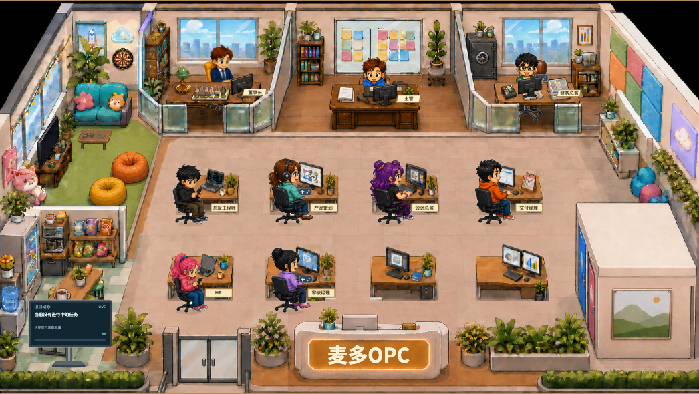

# 当前办公室素材

上图是启动当前代码后截取的办公室画面，不是单张场景底图。请以实际页面和 public/office-view.js 的场景组合为准，不能把某一张 PNG 直接当成整个办公室。

- office-manager.png：房间底图及桌面、玻璃等遮挡区域。原图中包含旧字牌，但右侧字牌在页面中由 office-refresh.png 的新版区域覆盖。
- office-refresh.png：前台及右侧区域更新图层。
- office-passages.png、office-lounge-clear.png：通道和休息区更新图层。
- office-desks-complete.png、office-reviewer-keyboard.png：实际使用的桌椅及键盘区域。
- boss-seated-unified.png、seated-typing-next.png、seated-phone-next.png 等：当前人物和动作素材。
- native/Assets/OPC.png：应用图标，不是办公室场景。

当前分享包只包含页面预加载清单所需的场景与人物 PNG，不再附带未使用的历史整图或候选稿。文件名及生成时间不代表最终渲染顺序；旧命名的局部素材可能仍是当前版本的必要组成，不能随意替换或删除。

公司名称是可编辑状态；前台文字会在页面中动态覆盖。修改时保留场景分层、人物动作、点击与遮挡逻辑，不要用静态预览图替代交互场景。

## 可编辑公司招牌

`office-sign-blank.png` 由内置 imagegen 对原始 office-refresh.png 编辑，要求只清除招牌文字、保持框体和灯光。页面仅采用文字区域的局部遮罩，场景其余部分沿用原素材。招牌文字使用随包提供的 Noto Sans SC，固定粗体、米白色、描边和阴影，按原图视觉匹配；原图没有可提取的源字体，因此并非原字形像素复刻。
字体来源：https://github.com/google/fonts/tree/main/ofl/notosanssc ，授权见 public/fonts/OFL.txt。改名无需联网或重新生成图片。
