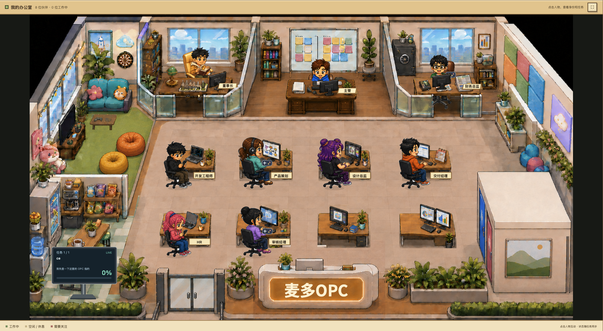

# OPC 源码分享试用包

完整安装、使用、更新与故障排查：[详细安装说明](INSTALL.md)。

这是朋友各自在自己电脑运行的办公室，不是分享者的 Codex 窗口链接。两种显示方式共用源码；公司名称、人物姓名、形象和绑定 Agent 都可以继续修改。

## 演示

## 交给朋友的 Agent

解压后把整个文件夹交给 Agent，复制下面的话：

> 请阅读 docs/AGENT-INSTALL.md 并在我的电脑上完成部署。请先问我公司叫什么 OPC。我选择【网页 / 独立窗口】，绑定【Codex / WorkBuddy / 两者】，需要随 Agent 启动自动打开。使用我的本机账号，保留现有其他配置。直接完成依赖检查、部署、绑定和真实任务验收；仅在需要我登录或开启系统权限时告诉我。不要把未验证的功能说成已通过。

当前画面预览和分层素材说明见 [ASSETS.md](ASSETS.md)。不要把单张底图当成最终办公室。

## 显示方式

| 选择 | macOS | Windows |
| --- | --- | --- |
| 网页 | 默认浏览器 | 默认浏览器 |
| 独立窗口 | 本机编译 OPC.app | 本机生成 OPC.exe，打开 Edge/Chrome 应用窗口 |

基本依赖：Node.js 24+、自己安装并登录的 Agent。网页运行不需要 npm install。macOS 原生窗口需要 Xcode 命令行工具；Windows 独立窗口需要 Edge/Chrome。人物自动生成与验收属于额外功能，需要 npm install、Chrome、Python 3 与 Pillow，不是基础运行依赖。

## 验证范围

- 发布者 Mac：真实双 Agent 派发、状态监测、回复、WorkBuddy 连续派单及单选问题回答已验证。
- 新增分享部署：详见包内 RELEASE-STATUS.md，区分程序测试、Mac 解压验收和 Windows 未验证项。
- Windows 尚未实机验收；尤其 Codex 桌面同步当前不支持，不能当作 Windows 双 Agent 完整版宣传。
- 每位朋友首次登录和 macOS 辅助功能授权需本人处理；Agent 不能代替这些系统交互。

## 后续使用

双击根目录启动文件，或运行 `node scripts/launch.mjs`。默认地址 http://127.0.0.1:4317 ，如部署时更换端口则用部署输出地址。独立入口保存在 dist。请保留整个源码目录。

伴随启动可通过部署参数启用或关闭。MCP 加载启动后台，进程监听器打开界面。关闭窗口不停止已经开始的任务；无需一直保持安装终端打开。

包不包含分享者的 .local、账号、聊天记录、真实任务验收日志或 node_modules。朋友自己的数据存入自己的 .local。继续转发时使用打包脚本（另需 Python 3）重新生成干净分享包，不把使用后的整个目录发出去。

公司名：首次部署询问，之后点击左上角公司名可修改。招牌字体随包提供，无需额外安装字体；文字自动居中，长名字自动缩小。

## 茶水间彩蛋

点空闲员工听段子，在档案里接话或换个话题。点“彩蛋更新”可暂停自动搜集或让 Agent 找新梗。日常点击不调用模型，后台联网搜集使用所绑定 Agent 的用量。网页/独立窗口共用本地对话库和去重记录。

安排任务时，点击“延续对话 · 手动选择”，选择所属项目及具体对话，再发送需求。Codex 和 WorkBuddy 都支持；手动选择后不再自动改判归属。未选择对话时不能按延续模式发送。

## 授权状态

目前为公开源码试用发布，尚未选择项目整体开源许可证；公开可查看不等于已授予任意使用、修改或再分发许可。字体单独遵循 public/fonts/OFL.txt，其他代码与场景素材的授权范围待作者明确。详情见 INSTALL.md。
